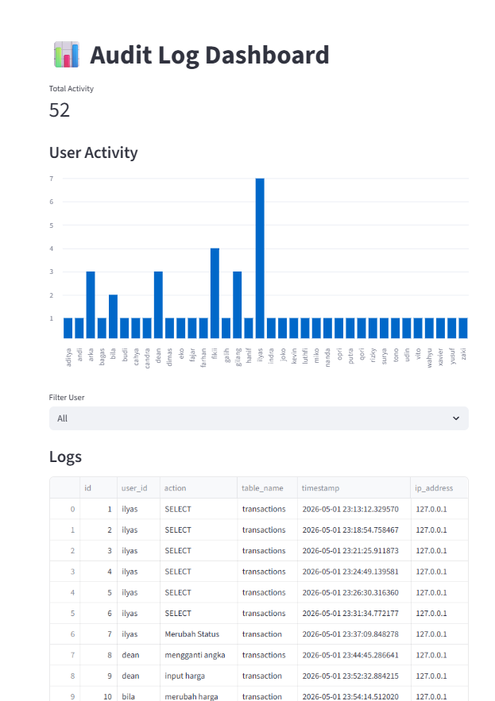
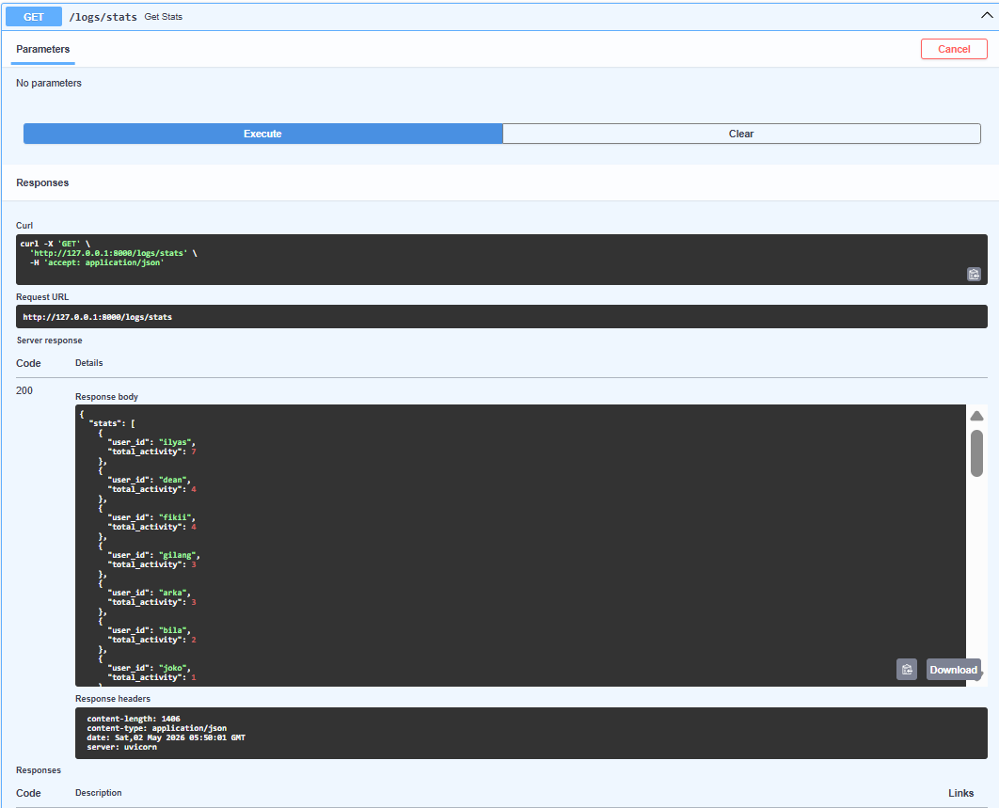
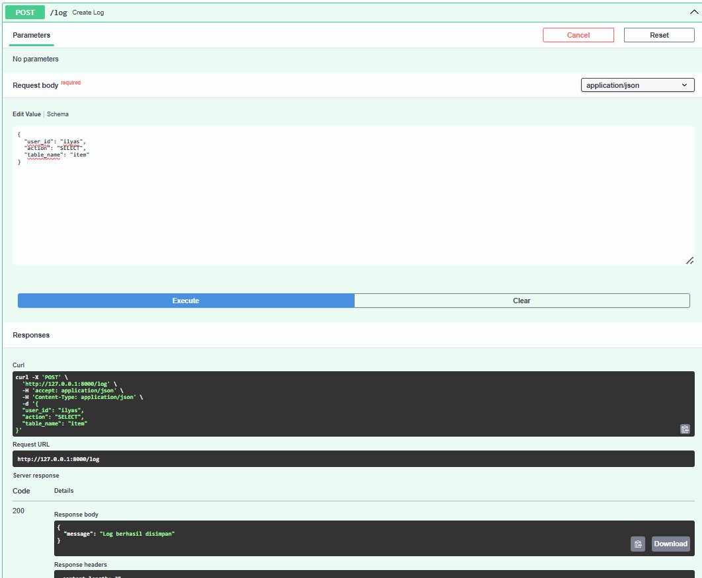

# Audit Log Monitoring System

A simple end-to-end system to track user activity, store audit logs, and visualize insights.

## Features
- Audit logging (user activity tracking)
- Store logs in PostgreSQL
- Filter & query logs
- User activity statistics
- Interactive dashboard (Streamlit)

## Architecture

User - FastAPI - PostgreSQL - Streamlit Dashboard

---

## Tech Stack
- FastAPI (Backend API)
- PostgreSQL (Database)
- Streamlit (Dashboard)
- Python

## Preview

